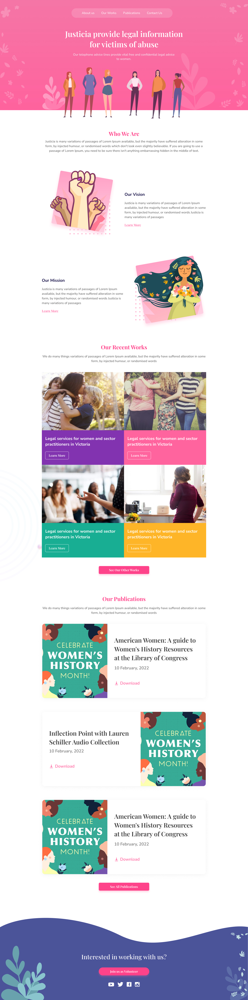
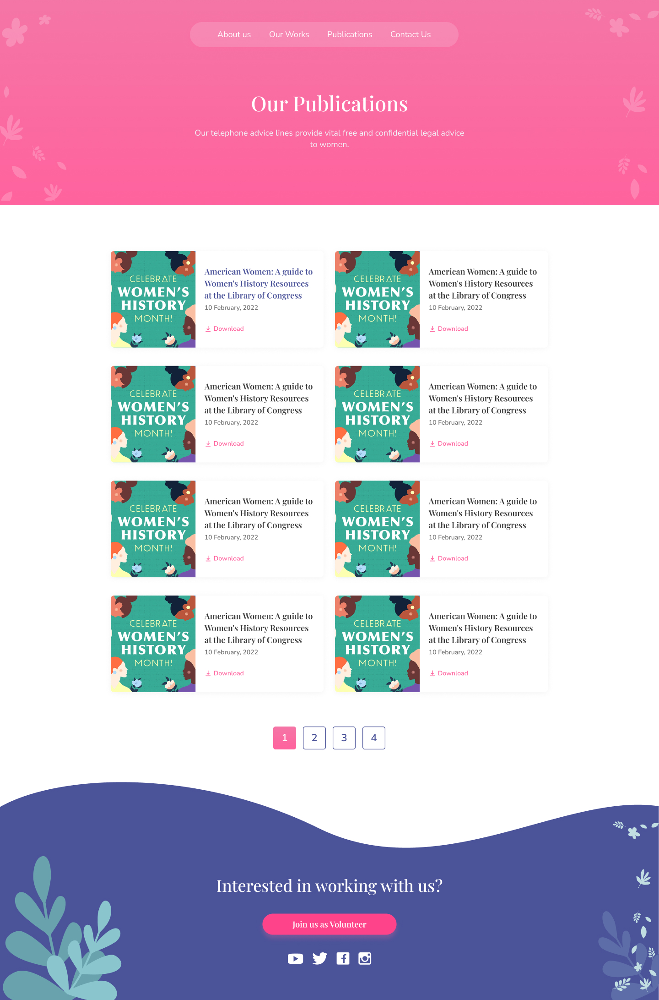

# Justicia

The mission of **Justicia** Project is to abolish child marriage, promote the rights of women and girls, and work towards women’s economic empowerment. WAP uses advocacy to promote and protect the rights of vulnerable and marginalized women and girls.

### Installation Instruction

<details>
<summary>Click to expand!</summary>

- Clone the Repository

  ```
  git clone https://github.com/saadh393/Justicia.git
  ```

- Install NPM Dependencies
  ```
  npm install
  ```

</details>

### Preview





